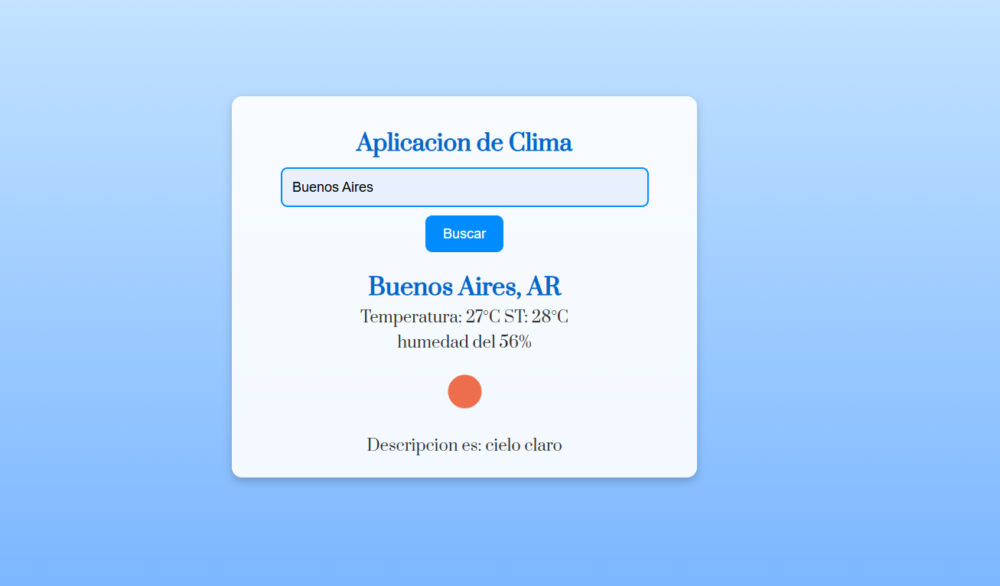

# 🌤️ Aplicación de Clima

Esta es una aplicación web que permite consultar el clima de cualquier ciudad en tiempo real utilizando la API de OpenWeatherMap. 🏙️☀️🌧️

## 🚀 Características

✅ Búsqueda de clima por nombre de ciudad  
✅ Muestra temperatura, sensación térmica, humedad y descripción del clima  
✅ Iconos representativos del clima  
✅ Diseño moderno con colores dinámicos  

## 🖥️ Captura de Pantalla



## 🔧 Tecnologías Utilizadas

- **HTML5**  
- **CSS3**  
- **JavaScript (ES6+)**  
- **API OpenWeatherMap**  

## 📌 Instalación y Uso

1. **Clonar el repositorio**
   ```sh
   git clone https://github.com/Carlos082023/consulta-clima.git
